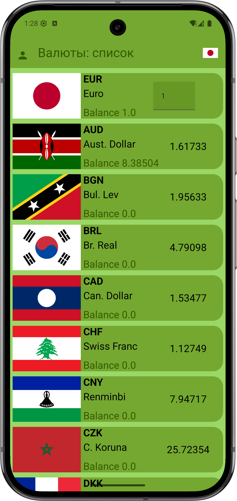
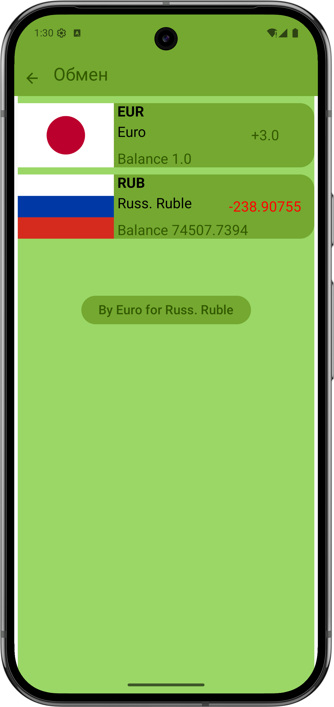
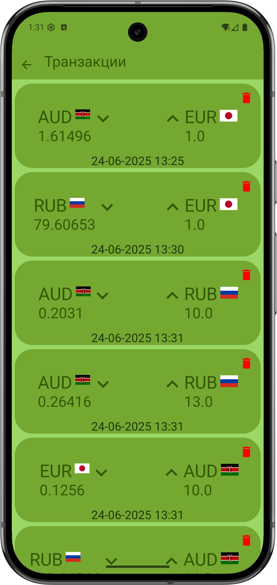

# Android-приложение для конвертации валют 📈💱

## Особенности реализации ⚙️

- **UI**: Реализован с использованием **Jetpack Compose** — современный инструментарий для построения интерфейсов.
- **Зависимости**: Управление зависимостями осуществляется с помощью **Dagger Hilt**, обеспечивая гибкость и масштабируемость проекта.
- **Архитектура**: Проект разработан согласно принципам **Clean Architecture**, гарантирующим четкое разделение ответственности между слоями приложения.
- **Асинхронность**: Для асинхронных операций используются **Coroutine** и **Flow**, обеспечивающие плавную работу приложения.

## Дополнительные возможности ✨

- Возможность удаления выполненных транзакций.
- Отображение значков текущих валют прямо в панели инструментов (**TopBar**).
- Хранение флажков стран непосредственно в ресурсах приложения.
  

## Скриншоты

